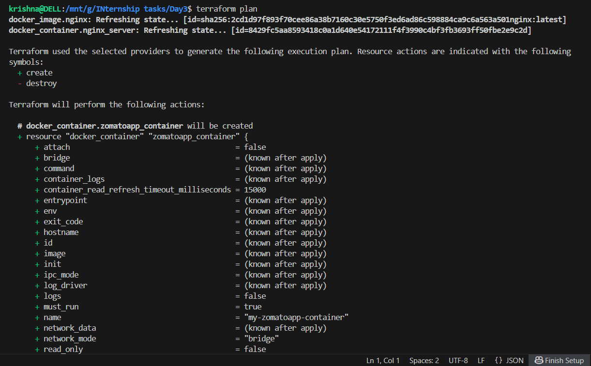
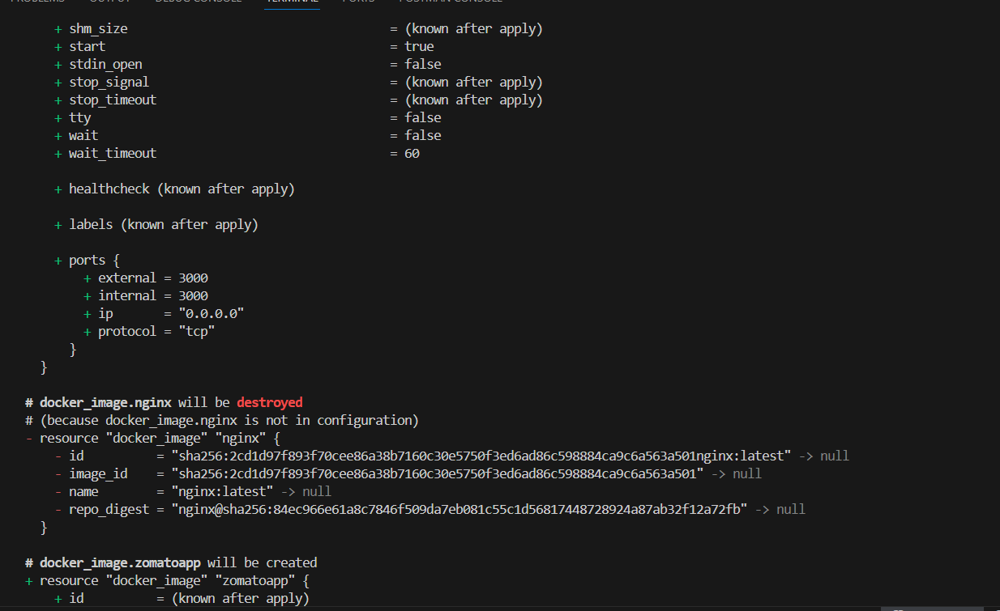
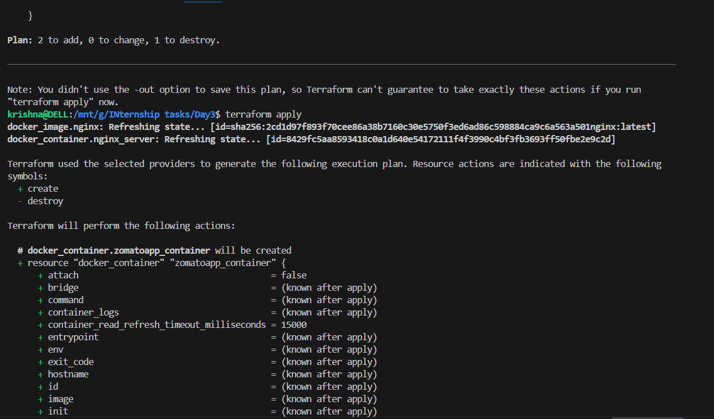
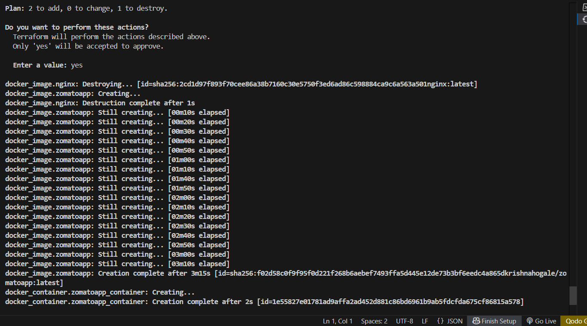

# Terraform Docker Container Provisioning

## Task Objective

Provision a local Docker container using Terraform with a custom Docker image `krishnahogale/zomatoapp:latest`.

## Prerequisites

- Docker installed and running on your local machine.
- Terraform installed.
- Access to the Docker image `krishnahogale/zomatoapp:latest` (ensure it is available on your local Docker or Docker Hub).

## Terraform Configuration

The `main.tf` Terraform configuration file includes:

- Docker provider setup.
- Pulling the custom Docker image `krishnahogale/zomatoapp:latest`.
- Running a container named `my-zomatoapp-container`.
- Mapping port 3000 of the container to port 3000 on the host, in accordance with the exposed port in the Dockerfile.

### main.tf snippet

```hcl
terraform {
  required_providers {
    docker = {
      source  = "kreuzwerker/docker"
      version = "~> 3.0"
    }
  }
}

provider "docker" {}

resource "docker_image" "zomatoapp" {
  name = "krishnahogale/zomatoapp:latest"
}

resource "docker_container" "zomatoapp_container" {
  image = docker_image.zomatoapp.image_id
  name  = "my-zomatoapp-container"
  ports {
    internal = 3000
    external = 3000
  }
}
```

## How to Use

1. Ensure Docker daemon is running on your machine.
2. Initialize Terraform:
   ```
   terraform init
   ```
3. Preview the planned infrastructure changes:
   ```
   terraform plan
   ```
4. Apply the Terraform configuration to provision the container:
   ```
   terraform apply
   ```
5. After successful provisioning, access your app at:
   ```
   http://localhost:3000
   ```
6. To destroy the resources when no longer needed:
   ```
   terraform destroy
   ```

## Troubleshooting

- If Terraform cannot connect to Docker, ensure Docker daemon is running and user permissions are correct.
- For image pull issues, verify the Docker image name and availability.
- Use `terraform state` commands to inspect managed resources.


<div align="center">
  
</div>

<div align="center">
  
</div>

<div align="center">
  

  <div align="center">
  
</div>

<div align="center">
  
</div>

